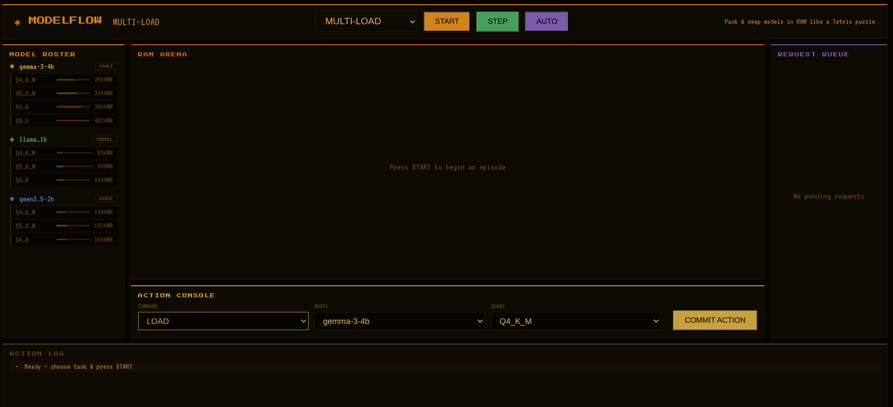
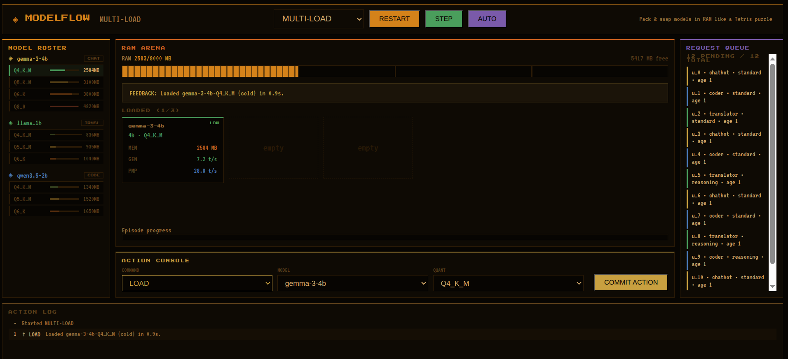
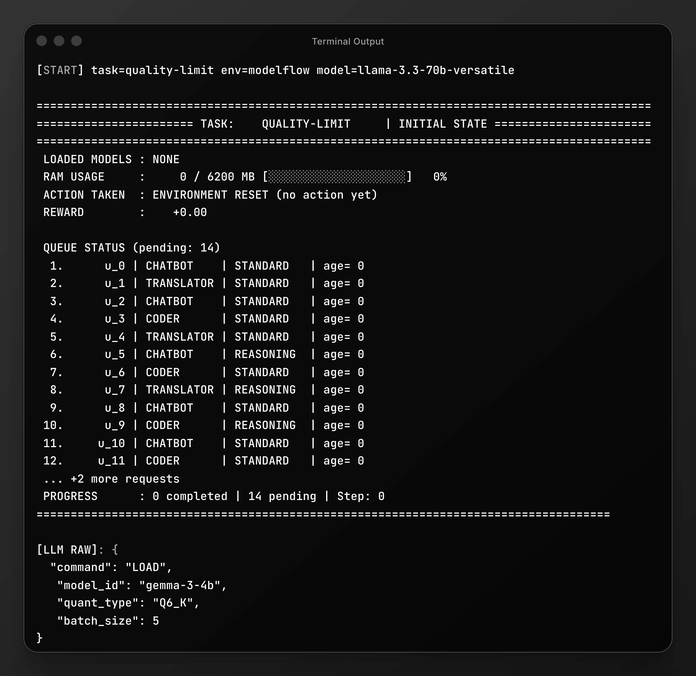

# ModelFlow LLM Orchestrator ⚙️

ModelFlow simulates a real-world LLM inference server operating under strict RAM constraints. It processes a stream of incoming requests that require different models, quantization levels, and compute resources.

An AI agent acts as an infrastructure orchestrator, responsible for:

Managing limited RAM capacity
Loading and evicting models efficiently
Selecting optimal quantization tiers
Handling CPU contention and execution delays

The objective is to clear the request queue accurately and efficiently while:

Avoiding Out-Of-Memory (OOM) errors
Minimizing latency and time penalties
Maximizing overall system performance

## Table of Contents
- [Manual UI Interaction](#manual-ui-interaction)
- [Images](#images)
  - [Dashboard 1](#dashboard-1)
  - [Dashboard 2](#dashboard-2)
  - [Terminal Output](#terminal-output)
- [How It Works](#how-it-works)
- [Tasks](#tasks)
- [Project Structure](#project-structure)
- [Quick Setup](#quick-setup)
- [Dataset & Baseline](#dataset--baseline)


## Manual UI Interaction
https://haider584-modelflow.hf.space

## Images

### Dashboard 



### Terminal Output



## How It Works

**Environment provides:**
- Current RAM usage
- Pending request queue
- Loaded models
- Available model/quantization options
- Action feedback

**Agent actions:**
- `LOAD(model_id, quant_type)` → Load model into RAM
- `EXECUTE(model_id, quant_type, batch_size)` → Process queued requests
- `EVICT(model_id, quant_type)` → Remove model from memory
- `REPLACE(model_id1, quant1, model_id2, quant2)` → Swap models
- `IDLE` → Do nothing for one step

**Observation (General):**
```
💾 Memory

* ram_used_mb → used RAM
* ram_limit_mb → total RAM
* ram_free_mb → free RAM
* pressure_spike_mb` → temporary spike
* spike_steps_remaining → spike duration

⚙️ System

* loaded_models → currently loaded models
* queue → pending requests
* model_summary → available models info
* available_model_types → chatbot / translator / coder

📊 State

* last_action_feedback → result of last action
* last_action_error → last error
* step_count → current step
* done → episode finished

📈 Performance

* info → metrics (reward, completed, pending, loads, evicts, etc.)
* reward → current reward

```
***

## Tasks
1. **Single Load (Easy)**:
A small batch of 9 simple, similar chatbot requests. This tests whether the agent can keep one model loaded and reuse it efficiently, without constantly reloading or swapping models unnecessarily.

2. **Multi Load (Medium)**:
A mix of 12 requests across chatbot, coder, and translator models, including both standard and reasoning tasks. This checks how well the agent chooses the right model on the fly and switches between them while balancing speed and memory.

2. **Quality Limit (Hard)**:
A set of 14 mixed requests, with more reasoning‑heavy tasks. The agent must pick stronger models for complex questions while still watching resource limits, testing its ability to make quality‑aware decisions under pressure.

3. **RAM Pressure (Hard+)**:
12 complex requests, with frequent reasoning demands under tight memory conditions. This pushes the agent to the limit in managing RAM loading, unloading, and evicting models smartly without triggering out‑of‑memory errors (OOM).

***

## 📁 Project Structure

```
model_flow/
│
├── inference.py          → Main execution loop (LLM decision-making + env interaction)
├── client.py            
├── config.py             → Global configuration (models, API settings, retries)
├── graders.py            → Evaluation and scoring logic for benchmarking
├── models.py             → Shared data classes (actions, observations, request schema)
├── prompt.py             → Builds prompts and formats environment state for LLM
├── README.md             → Project documentation
├── requirements.txt      → Python dependencies
├── Dockerfile            → Container setup for deployment
├── pyproject.toml        → Project metadata and build configuration
├── openenv.yaml          → Environment configuration (OpenEnv setup)
│
├── Data/
│   └── combined_model_metrics.json  → Model performance stats (RAM, latency, throughput)
│
├── helpers/
│   ├── context_utils.py     → Context/window management for LLM inputs
│   ├── llm_utils.py         → LLM API calls, retries, response handling
│   ├── model_utils.py       → Model size, quantization, load feasibility logic
│   ├── planning.py          → Safety layer (overrides bad actions, constraints)
│   ├── queue_utils.py       → Queue analysis (pending requests, workload)
│   ├── tools.py             → Core simulation utilities (memory checks, execution)
│   └── visualization.py     → Debugging and terminal visualization tools
│
├── server/
│   ├── app.py                  → FastAPI server (API endpoints + backend)
│   ├── constants.py            → System constants (quant levels, limits)
│   ├── groq_helper.py          → Optional Groq API integration
│   ├── metrics_loader.py       → Loads and processes model metrics dataset
│   └── modelflow_environment.py → Core simulation engine (step, reset, rewards)
│
├── scripts/
│   ├── dashboard.html  → Base HTML for frontend dashboard
│   ├── app.jsx         → Main React app component
│   ├── core.jsx        → Core dashboard logic
│   ├── index.jsx       → Entry point for React app
│   └── ui.jsx          → UI components and layout
```
***
## Quick Setup

### Local
```bash
# Create virtual environment using uv
uv venv
source .venv/bin/activate

# Install dependencies
uv sync

# ==============================
# Environment Configuration
# ==============================


# Common (Hugging Face)
export API_BASE_URL="https://router.huggingface.co/v1"
export MODEL_NAME="Qwen/Qwen2.5-72B-Instruct"
export HF_TOKEN="your_huggingface_token_here"

# Groq (only required if USE_GROQ_ONLY=1)
export GROQ_API_KEY="your_groq_api_key_here"

# ==============================
# Run
# ==============================

# Run inference script for agent interaction
python inference.py

# Start server for UI Dashboard or to access endpoints
python -m uvicorn server.app:app --port 8000 
```

### Docker
```bash
docker build -t modelflow -f Dockerfile .
docker run -d -p 8000:8000 modelflow
```

**Access:**
- API Docs: `http://localhost:8000/docs`
- Dashboard: `http://localhost:8000/dashboard`

***

## Dataset & Baseline

**Dataset:** `Data/combined_model_metrics.json`  
**Profiled on:** Intel i3 laptop (8GB RAM)  
**Source:** [Benchmarking repo](https://github.com/MdSufiyan005/BenchMarking)

**Baseline Scores (Agent: GROQ API – LLaMA 3.3 70B Versatile):**
| Task          | Score |
| ------------- | ----- |
| Single Load   | 0.88  |
| Multi Load    | 0.64  |
| Quality Limit | 0.69  |
| RAM Pressure  | 0.54  |


